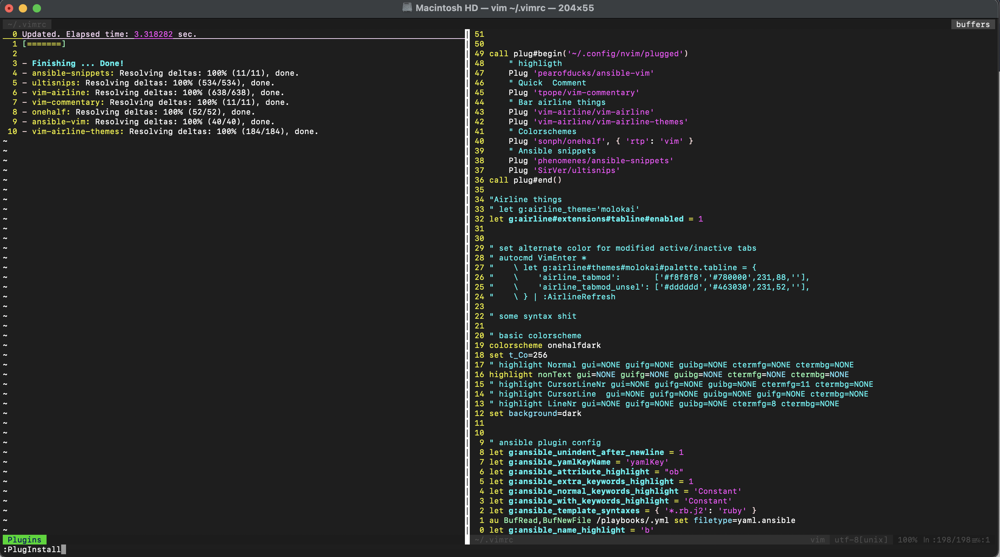

# vimconfig


```sh
curl -fLo ~/.vim/autoload/plug.vim --create-dirs \
    https://raw.githubusercontent.com/junegunn/vim-plug/master/plug.vim
``` 


```yaml

autocmd FileType yaml setlocal ai ts=2 sw=2 et nu cuc
autocmd FileType yaml colo desert


In File: vim ~/.vimrc


Editor remove all comments:
g/^#/d

Editor remove all:
:1,$d


====================================================
curl -fLo ~/.vim/autoload/plug.vim --create-dirs \
    https://raw.githubusercontent.com/junegunn/vim-plug/master/plug.vim


autocmd FileType yaml setlocal ai ts=2 sw=2 et nu cuc
autocmd FileType yaml colo desert
set relativenumber

" spaces & tabs
set shiftwidth=4
set tabstop=4
set softtabstop=4
set smarttab
set expandtab
set autoindent


" Spell checking
set nospell
nnoremap <C-E> :setlocal spell! spelllang=en<CR>
nnoremap <C-G> :setlocal spell! spelllang=de<CR>

" Shortcutting split navigation, saving a keypress:
map <C-h> <C-w>h
map <C-j> <C-w>j
map <C-k> <C-w>k
map <C-l> <C-w>l

" set leader Key
let mapleader =" "
" set local leader to \
let maplocalleader = "\\"

" buffer navigation
nnoremap <C-N> :bnext<CR>
nnoremap <C-P> :bprev<CR>
" map esc to jk
inoremap jk <esc>


call plug#begin('~/.config/nvim/plugged')
    " highligth
    Plug 'pearofducks/ansible-vim'
    " Quick  Comment
    Plug 'tpope/vim-commentary'
    " Bar airline things
    Plug 'vim-airline/vim-airline'
    Plug 'vim-airline/vim-airline-themes'
    " Colorschemes
    Plug 'sonph/onehalf', { 'rtp': 'vim' }
    " Ansible snippets
    Plug 'phenomenes/ansible-snippets'
    Plug 'SirVer/ultisnips'
call plug#end()

"Airline things
" let g:airline_theme='molokai'
let g:airline#extensions#tabline#enabled = 1


" set alternate color for modified active/inactive tabs
" autocmd VimEnter *
"    \ let g:airline#themes#molokai#palette.tabline = {
"    \    'airline_tabmod':       ['#f8f8f8','#780000',231,88,''],
"    \    'airline_tabmod_unsel': ['#dddddd','#463030',231,52,''],
"    \ } | :AirlineRefresh

" some syntax shit

" basic colorscheme
colorscheme onehalfdark
set t_Co=256
" highlight Normal gui=NONE guifg=NONE guibg=NONE ctermfg=NONE ctermbg=NONE
highlight nonText gui=NONE guifg=NONE guibg=NONE ctermfg=NONE ctermbg=NONE
" highlight CursorLineNr gui=NONE guifg=NONE guibg=NONE ctermfg=11 ctermbg=NONE
" highlight CursorLine  gui=NONE guifg=NONE guibg=NONE guifg=NONE ctermbg=NONE
" highlight LineNr gui=NONE guifg=NONE guibg=NONE ctermfg=8 ctermbg=NONE
set background=dark


" ansible plugin config
let g:ansible_unindent_after_newline = 1
let g:ansible_yamlKeyName = 'yamlKey'
let g:ansible_attribute_highlight = "ob"
let g:ansible_extra_keywords_highlight = 1
let g:ansible_normal_keywords_highlight = 'Constant'
let g:ansible_with_keywords_highlight = 'Constant'
let g:ansible_template_syntaxes = { '*.rb.j2': 'ruby' }
au BufRead,BufNewFile /playbooks/.yml set filetype=yaml.ansible
let g:ansible_name_highlight = 'b'


==================================================
autocmd FileType yaml setlocal ai ts=2 sw=2 et nu cuc
autocmd FileType yaml colo desert
set relativenumber

" spaces & tabs
set shiftwidth=4
set tabstop=4
set softtabstop=4
set smarttab
set expandtab
set autoindent


" Spell checking
set nospell
nnoremap <C-E> :setlocal spell! spelllang=en<CR>
nnoremap <C-G> :setlocal spell! spelllang=de<CR>

" Shortcutting split navigation, saving a keypress:
map <C-h> <C-w>h
map <C-j> <C-w>j
map <C-k> <C-w>k
map <C-l> <C-w>l

" set leader Key
let mapleader =" "
" set local leader to \
let maplocalleader = "\\"

" buffer navigation
nnoremap <C-N> :bnext<CR>
nnoremap <C-P> :bprev<CR>
" map esc to jk
inoremap jk <esc>


call plug#begin('~/.config/nvim/plugged')
    " highligth
    Plug 'pearofducks/ansible-vim'
    " Quick  Comment
    Plug 'tpope/vim-commentary'
    " Bar airline things
    Plug 'vim-airline/vim-airline'
    Plug 'vim-airline/vim-airline-themes'
    " Colorschemes
    Plug 'sonph/onehalf', { 'rtp': 'vim' }
    " Ansible snippets
    Plug 'phenomenes/ansible-snippets'
    Plug 'SirVer/ultisnips'
call plug#end()

"Airline things
" let g:airline_theme='molokai'
let g:airline#extensions#tabline#enabled = 1


" set alternate color for modified active/inactive tabs
" autocmd VimEnter *
"    \ let g:airline#themes#molokai#palette.tabline = {
"    \    'airline_tabmod':       ['#f8f8f8','#780000',231,88,''],
"    \    'airline_tabmod_unsel': ['#dddddd','#463030',231,52,''],
"    \ } | :AirlineRefresh

" some syntax shit

" basic colorscheme
colorscheme onehalfdark
set t_Co=256
" highlight Normal gui=NONE guifg=NONE guibg=NONE ctermfg=NONE ctermbg=NONE
highlight nonText gui=NONE guifg=NONE guibg=NONE ctermfg=NONE ctermbg=NONE
" highlight CursorLineNr gui=NONE guifg=NONE guibg=NONE ctermfg=11 ctermbg=NONE
" highlight CursorLine  gui=NONE guifg=NONE guibg=NONE guifg=NONE ctermbg=NONE
" highlight LineNr gui=NONE guifg=NONE guibg=NONE ctermfg=8 ctermbg=NONE
set background=dark


" ansible plugin config
let g:ansible_unindent_after_newline = 1
let g:ansible_yamlKeyName = 'yamlKey'
let g:ansible_attribute_highlight = "ob"
let g:ansible_extra_keywords_highlight = 1
let g:ansible_normal_keywords_highlight = 'Constant'
let g:ansible_with_keywords_highlight = 'Constant'
let g:ansible_template_syntaxes = { '*.rb.j2': 'ruby' }
au BufRead,BufNewFile /playbooks/.yml set filetype=yaml.ansible
let g:ansible_name_highlight = 'b'


```  


